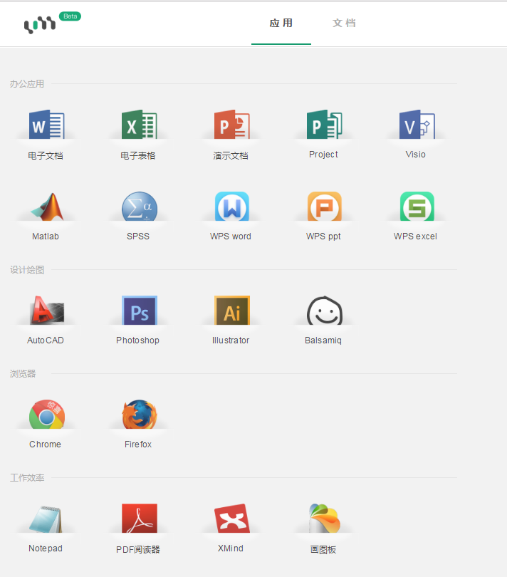
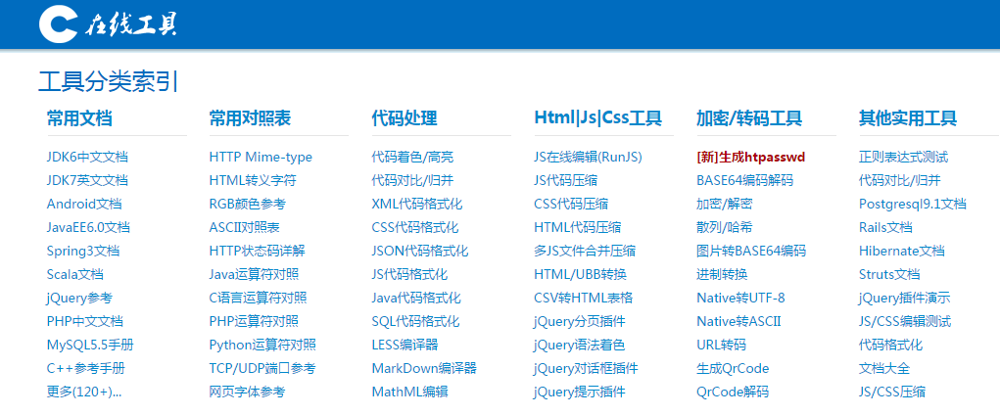
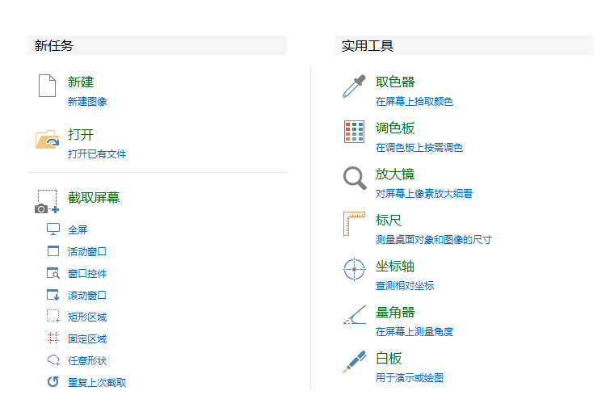
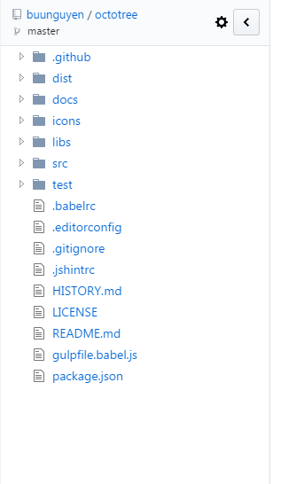

分享一些网站和工具
====================

[博客类](#博客类)  
[值得Android开发者阅读系列](#值得Android开发者阅读系列)   
[高质量Android社区](#高质量Android社区)   
[各种开源控件/项目](#各种开源控件/项目)   
[优秀网站（不限编程语言）](#优秀网站不限编程语言)  
[视频学习（不限编程语言）](#视频学习不限编程语言)  
[工具类网站](#工具类网站)  
[日常工具类软件](#日常工具类软件)  
[chrome浏览器插件类](#chrome浏览器插件类)  
[阅读](#阅读)  

博客类
-------------------------------  

 - [android-dev-cn](https://github.com/android-cn/android-dev-cn)

值得Android开发者阅读系列
-------------------------------

 - [Android学习之路](http://stormzhang.com/android/2014/07/07/learn-android-from-rookie/)   
	stormzhang的Android学习之路
 - [Android-Tips](https://github.com/tangqi92/Android-Tips)  
	作者收集了大量Android开发Tip
 - [值得阅读的android技术文章](https://github.com/bboyfeiyu/Worth-Reading-the-Android-technical-articles)  
	如题
 - [整理一些比较好的Android开发教程](http://bxbxbai.github.io/2014/10/07/android-develop-resource/)  
	这些都是该作者在学习Android开发过程中觉得比较好的教程和博客
 - [Android应用性能调优的技术点](http://zhuanlan.zhihu.com/kaede/20326073)  
	如题  
 - [Android界面设计视觉规范](http://www.woshipm.com/ucd/243897.html?utm_source=tuicool&utm_medium=referral)  
	如题
 - [AndroidNote](https://github.com/GcsSloop/AndroidNote)  
	android自定义view讲解
 - [hencoder](http://hencoder.com/)  
   给高级 Android 工程师的进阶手册

高质量Android社区
-------------------------------

 - [Stackoverflow](http://stackoverflow.com/questions/tagged/android) —— 国外著名的问答社区
 - [V2ex —— V2ex Android板块](https://www.v2ex.com/go/android)
 - [Android 开发技术周报](http://www.androidweekly.cn/) —— 长期更新最新前言资讯
 - [开发技术前线](http://www.devtf.cn/) —— 《Android源码设计模式》作者 Mr.Simple 维护的社区网站
 - [泡在网上的日子](http://www.jcodecraeer.com/) —— 大量第三方控件基地
 - [开源中国](http://www.oschina.net/android) —— OsChina
 - [23code](http://www.23code.com/) —— android经典开源代码分享
 - [App开发者](http://www.aswifter.com/) —— 分享Android/IOS/Swift开发和互联网内容
 - [JavaApk.com](http://www.javaapk.com/) —— 安卓demo聚集地，部分源码需购买VIP
 - [DevStore](http://www.devstore.cn/code/list/ft85-pn1-or0.html) —— 各种Demo，以及第三方服务
 - [第七城市](http://123.th7.cn/code/MagicPie_1678.html) — android/ios代码实例分享平台
 - [diycode](https://www.diycode.cc/) —优雅、极客、创意、分享、美好

各种开源控件/项目
-------------------------------

 - [https://github.com/Trinea/android-open-project](https://github.com/Trinea/android-open-project)  

		Android 开源项目第一篇——个性化控件(View)篇
		  包括ListView、ActionBar、Menu、ViewPager、Gallery、GridView、ImageView、ProgressBar、TextView、ScrollView、TimeView、TipView、FlipView、ColorPickView、GraphView、UI Style、其他
		Android 开源项目第二篇——工具库篇
		  包括依赖注入、图片缓存、网络请求、数据库 ORM 工具包、Android 公共库、高版本向低版本兼容库、多媒体、事件总线、传感器、安全、插件化、文件、其他
		Android 开源项目第三篇——优秀项目篇
		  比较有意思的完整的 Android 项目
		Android 开源项目第四篇——开发及测试工具篇
		  包括开发效率工具、开发自测相关、测试工具、开发及编译环境、其他
		Android 开源项目第五篇——优秀个人和团体篇
		  乐于分享并且有一些很不错的开源项目的个人和组织，包括 JakeWharton、Chris Banes、Koushik Dutta 等大牛
 - [Android学习资源网站大全](https://github.com/zhujun2730/Android-Learning-Resources)  

		Android学习资源网站大全
		优质学习资源
		值得关注的大牛博客
		值得Android开发者阅读系列
		性能优化
		UI自定义View
		网络相关
		RxJava相关
		MVP/MVVM架构相关
		插件化开发
		单元测试系列
		高质量Android社区
		开发工具第三方开源项目
		视频学习网站
		面试相关

优秀网站（不限编程语言）
-------------------------------

 - [GitHub——全球最大同性交友网站](https://github.com/)  
	开源了世界上大部分优秀的代码
 - [stackoverflow](http://stackoverflow.com/)  
	你能遇到的大部分问题和答案都能在上面找到
 - [gitbook](https://www.gitbook.com/)  
	各种免费优秀的书籍，笔记，博客

视频学习（不限编程语言）
---------------------------------
 - [网易公开课](https://open.163.com/)
 - [中国大学mooc](http://www.icourse163.org/)  
 - [慕课网](http://www.imooc.com/)  

工具类网站
---------------------------------
 - [草料二维码](http://cli.im/)  
	根据文字信息在线生成二维码
 - [pdf转word](https://smallpdf.com/zh-TW/pdf-to-word)  
	完美而迅速地將PDF轉換成Word檔案
 - [jsonschema2pojo](http://www.jsonschema2pojo.org/)  
	在线将json格式数据转换成java类
 - [uzer.me](https://uzer.me/z/apps)  
	在线办公套件，如果你不想安装office套件或者wps，ps，pdf阅读器等等工具，可以直接在线使用
	
 - [tool.oschina.net](http://tool.oschina.net/)      
	
 - [stackedit](https://stackedit.io/editor)    
	在线使用markdown语法编写文档
 - [百度脑图](http://naotu.baidu.com)  
	在线制作思维导图
 - [learngitbranching](http://learngitbranching.js.org)  
	你对 Git 感兴趣吗？那么算是来对地方了！ “Learning Git Branching” 可以说是目前为止最好的教程了，在沙盒里你能执行相应的命令，还能看到每个命令的执行情况； 通过一系列刺激的关卡挑战，逐步深入的学习 Git 的强大功能，在这个过程中你可能还会发现一些有意思的事情。
 - [iconfont](http://www.iconfont.cn/)  
	阿里巴巴矢量图标库

日常工具类软件
---------------------------------
 - **staruml**  
	StarUML是一款开放源码的UML开发工具
 - **powerdesigner**  
	一个强大的数据库设计工具
 - **navicat**  
	数据库管理工具，基本支持所有主流的数据库管理
 - **xshell**  
	一个强大的安全终端模拟软件，通常用来远程连接linux服务器
 - **Notepad++**，**editplus**，**sublime text**,**atom**,**vs code**  
	强大的文本编辑器，选一款，练熟它。如果你非要用vim，请无视~
 - [ScreenToGif](http://screentogif.codeplex.com/)  
	gif截图工具
 - [cockos](http://www.cockos.com/licecap/)  
	gif截图工具2
 - [picpick](http://ngwin.com/picpick)  
	截图，取色器，调色板，放大镜，标尺，坐标轴，量角器，白板  
	
 - [everything](http://www.voidtools.com/)  
	强大的本地文件搜索器。
 - [rufus](http://rufus.akeo.ie/?locale=zh_CN)  

		Rufus 是一个可以帮助格式化和创建可引导USB闪存盘的工具，比如 USB 随身碟，记忆棒等等。

		在如下场景中会非常有用：

			你需要把一些可引导的ISO格式的镜像（Windows，Linux，UEFI等）创建成USB安装盘的时候
			你需要使用一个还没有安装操作系统的设备的时候
			你需要从DOS系统刷写BIOS或者其他固件的时候
			你需要运行一个非常底层的工具的时候

		Rufus 麻雀虽小，五脏俱全，体积虽小，功能全面。

 - [Listen 1](https://github.com/listen1/listen1_chrome_extension)  

		缘起)

		当我发现找个想听的歌因为版权听不了，需要打开好几个网站开始搜索，来回切换让我抓狂的时候，我知道是时候该做点什么了。

		妈妈再也不用担心我找不到我想听的歌了。这里包含了网易云音乐，虾米，QQ音乐的曲库，够全够大了吧。

		搜歌，听歌，就用 Listen1。

chrome浏览器插件类
---------------------------------  
 - [Tampermonkey](http://tampermonkey.net/)  
	Tampermonkey 是一款免费的浏览器扩展和最为流行的用户脚本管理器，它适用于 Chrome, Microsoft Edge, Safari, Opera Next, 和 Firefox。
 - [github目录插件](https://github.com/buunguyen/octotree)  
	直接预览github上项目的目录，再也不要跳来跳去了
	
 - [Chrono下载管理器](https://chrome.google.com/webstore/detail/chrono-download-manager/mciiogijehkdemklbdcbfkefimifhecn)  
	管理下载和嗅探资源  
	
 - [Infinity新标签页](https://chrome.google.com/webstore/detail/infinity-new-tab/dbfmnekepjoapopniengjbcpnbljalfg?utm_source=chrome-app-launcher-info-dialog)  
	不多说看图
	
 - [jsonView jsonViewer json formatter 格式化](https://chrome.google.com/webstore/detail/jsonview-jsonviewer-json/hdmbdioamgdkppmocchpkjhbpfmpjiei)  
	直接将你访问到的json数据格式化，不用再复制到其他网站或者软件里面格式化了
	
 - [postman](https://chrome.google.com/webstore/detail/postman/fhbjgbiflinjbdggehcddcbncdddomop?utm_source=chrome-app-launcher-info-dialog)  
	http调试工具，超级方便
	

阅读
---------------------------------
 - [A Programmer Prepares(程序员的自我修养)](https://www.gitbook.com/book/leohxj/a-programmer-prepares)  
	收录了很多计算机方面的知识点。

 - [剑指offer题解](http://blog.csdn.net/column/details/pointtooffer.html)  
	使用java完成了剑指offer上的所有题目，包括拓展题目  

 - [经典编程书籍大全](https://github.com/jobbole/awesome-programming-books)  

 - [那些被岁月遗忘的 UNIX 经典著作](http://blog.jobbole.com/103989/)  

 - [《编程之法：面试和算法心得》](https://github.com/julycoding/The-Art-Of-Programming-By-July)  

 - [免费的计算机编程类中文书籍](https://github.com/justjavac/free-programming-books-zh_CN)  

 - [Gradle User Guide 中文版](https://www.gitbook.com/book/dongchuan/gradle-user-guide-/details)  

 - [http2讲解](https://www.gitbook.com/book/ye11ow/http2-explained/details)

 - [零基础学Python](https://www.gitbook.com/book/looly/python-basic/details)

 - [未来世界的幸存者](https://ruanyf.github.io/survivor/)  
  阮一峰老师的新书

 - [Deep Learning 中文翻译](https://github.com/exacity/deeplearningbook-chinese)  
  一份不错的中文版机器学习资料  
 - [Pro Git，第二版，简体中文](https://www.gitbook.com/book/bingohuang/progit2/details)

以上部分资料出处
---------------------------------  

##感谢
 - [http://blog.csdn.net/lowprofile_coding/article/details/51059080](http://blog.csdn.net/lowprofile_coding/article/details/51059080)
 - [https://github.com/zhujun2730/Android-Learning-Resources](https://github.com/zhujun2730/Android-Learning-Resources)
 - [https://github.com/android-cn/android-dev-cn](https://github.com/android-cn/android-dev-cn)
 - [最良心的软件可以良心到什么程度？](https://www.zhihu.com/question/52157612/answer/181351977)

**如果有引用了没有在此注明的请联系我，对此深感抱歉。**
